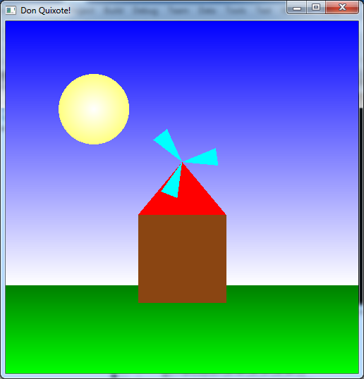

**Written Questions Due: Thursday, Sept 14th by 12:30/2:00 PM** (in class)

**Program Due: Thursday, Sept 14th by 11:59 PM** Late assignments will be penalized 20 points per day.

0\. Getting Started
==================

Download [CS370\_Assign01.zip](src/CS370_Assign01.zip), saving it into the **assignment** directory.

Double-click on **CS370\_Assign01.zip** and extract the contents of the archive into a subdirectory called **CS370\_Assign01**

Navigate into the **CS370\_Assign01** directory and double-click on **CS370\_Assign01.sln** (the file with the little Visual Studio icon with the 13 on it).

If the source file is not already open in the main window, open the source file by expanding the *Source Files* item in the *Solution Explorer* window and double-clicking **DonQuixote.cpp**.

1\. Written Questions
====================

1.  What are the main advantages and main disadvantages to generating images using the graphics pipeline?
2.  Typical movies that use 35mm film have frames with a resolution of greater than 2000x3000 pixels. What implications would attempting to render similar resolutions on a computer display using computer generated graphics have? Consider both real-time rendering and pre-rendered animations.
3.  In order to "fill" a polygonal area, we must determine which pixels are inside and which are outside the polygon boundaries. Testing each point individually would be extremely inefficient. Think of a strategy that could be used to avoid point-by-point testing. Hint: Consider scaning via horizontal lines.
4.  Since *simple* polygons are extremely important for proper rendering, give a method to test whether or not a polygon is simple. Hint: Consider edge intersections.

2\. Programming assignment
=========================

Write a program that draws a simple 2D "windmill" scene using OpenGL. The scene should include:

-   A shaded blue sky from top to bottom
-   A shaded green lawn from bottom to top
-   A shaded yellow sun from center to edge
-   A windmill with brown walls, red roof, and cyan fan blades.
-   \<space\> should start/stop the windmill fan spinning
-   \<esc\> should quit the program

*Hints:*

> OpenGL renders scenes using a *Painter's Algorithm* (at least for now). In this type of algorithm, the object that is rendered *last* will appear on *top*. This can be useful for making complicated shapes by simply overlapping simple shapes rather than using a single polygon with many vertices.
>
> **GL\_POLYGON** is *not* the only type of object that can be rendered in OpenGL. Section 2.12 of *OpenGL: A Primer* discusses several other built-in objects that can be defined by a set of vertices.
>
> Use *global variables* to avoid *magic numbers* in the code, particularly for object geometries and colors.

Grading Criteria
================

**The program MUST compile to receive any credit** (so develop incrementally).

For up to 70% credit: Draw the basic scene without the fan using hard coded vertices, no animation

For up to 80% credit: Draw the various rectangular objects (sky, lawn, windmill walls) *using the* **sqr** *instance vertices provided at the top of the code*, no fan, no animation

For up to 85% credit: Draw the various rectangular objects (sky, lawn, windmill walls) using the **sqr** instance vertices provided at the top of the code, *draw fan*, no animation

For up to 90% credit: Draw the various rectangular objects (sky, lawn, windmill walls) using the **sqr** instance vertices provided at the top of the code, draw fan, *have animation capabilities*

For above 90% credit: *Be creative!* For example, have the \<space\> act like a "puff" of air that starts the fan spinning but then gradually slows down until another \<space\> is pressed. Another option would be to add a keypress that changes the scene from day to night with the sun changing to a moon.

Compiling and running the program
=================================

Once you have completed typing in the code, you can build and run the program in one of two ways:

> -   Click the small green arrow in the middle of the top toolbar
> -   Hit **F5** (or **Ctrl-F5**)

(On Linux/OSX: In a terminal window, navigate to the directory containing the source file and simply type **make**. To run the program type **./DonQuixote.exe**)

The output should look similar to below

> 

To quit the program simply close the window.

Submitting to Marmoset
======================

To submit your completed assignment, open a terminal window, navigate to the working directory and type:

    make submit

Then enter your Marmoset id and password. You should see a confirmation that the file was submitted successfully.

**You are responsible for making sure that your submission contains the correct file(s).**

